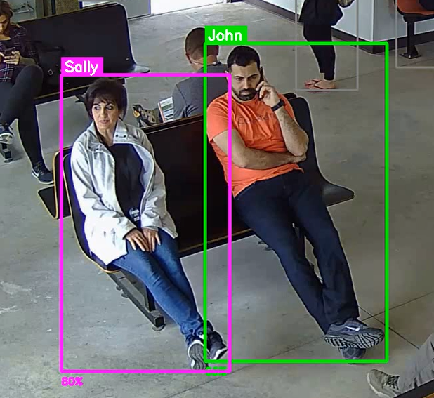

# Face Recognition Model Benchmarks

## Model Overview

| Property | Value |
|----------|-------|
| **Model File** | `Facial_Reco_lightweight.onnx` |
| **Size** | 7.85 MB |
| **Parameters** | ~2.05M |
| **Input** | 112×112 RGB |
| **Embedding** | 512-dim |

*Example recognition output.*

---

## Benchmark Results

Evaluated using standard face verification benchmarks with 10-fold cross-validation.

| Benchmark | Accuracy | Std Dev |
|-----------|----------|---------|
| **LFW** | 99.72% | ±0.25% |
| **CFP-FP** | 97.73% | ±0.55% |
| **AgeDB-30** | 96.62% | ±0.93% |

---

## Comparison with Other Models

| Model | Size | Params | LFW | CFP-FP | AgeDB-30 |
|-------|------|--------|-----|--------|----------|
| **Facial_Reco_lightweight (My)** | **7.8 MB** | **2.0M** | **99.72%** | 97.73% | 96.62% |
| MobileFaceNet@WebFace600K | 13.0 MB | 3.4M | 99.62% | 97.73% | 96.48% |
| ResNet50@WebFace600K | 166.3 MB | 43.6M | 99.82% | 99.26% | 98.12% |

**Key Finding**: My model outperforms InsightFace's MobileFaceNet despite being 40% smaller.

---

## Benchmark Datasets

| Dataset | Purpose | Pairs | Images |
|---------|---------|-------|--------|
| **LFW** | General face verification | 6,000 | 12,000 |
| **CFP-FP** | Frontal-to-profile matching | 7,000 | 14,000 |
| **AgeDB-30** | Cross-age verification (30yr gap) | 6,000 | 12,000 |

All benchmarks use a balanced 50/50 split of positive (same person) and negative (different person) pairs.

---

## Evaluation Protocol

- **Format**: InsightFace `.bin` format
- **Validation**: 10-fold cross-validation
- **Similarity**: L2 distance on normalized embeddings
- **Flip Augmentation**: Enabled (average of original + horizontally flipped)

---

## Summary

This lightweight model achieves state-of-the-art accuracy for its size class, making it ideal for edge deployment and mobile applications where model size and inference speed are critical.
